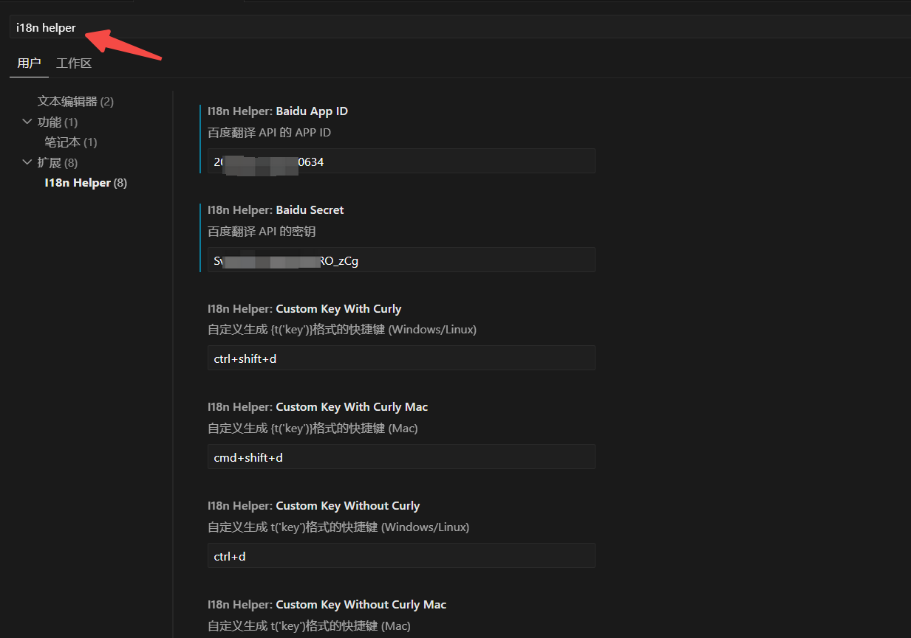
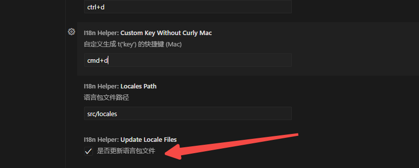

# i18n Helper

**i18n Helper** 是一个 VSCode 插件，旨在帮助开发者快速生成国际化（i18n）翻译键，并轻松管理多语言内容。通过选中文本并生成对应的国际化键，插件会自动将选中的中文替换为国际化表达式，并将翻译内容写入对应的语言包 JSON 文件，简化国际化工作流程，让你可以专注于编码，无需担心繁琐的翻译过程。

## 特性
- 自动提取并管理国际化文本
- 支持生成 `{t('key')}` 或 `t('key')` 格式
- 支持自定义快捷键，提升工作效率
- 自动更新语言包文件，无需手动干预

## 安装

1. 打开 **VSCode** 编辑器。
2. 点击侧边栏的 **扩展** 图标，进入扩展市场。
3. 在搜索框中输入 **"i18n Helper"** 并点击 **安装** 按钮。

## 使用

首先，在插件设置中配置百度翻译 API 密钥等信息。
百度翻译API密钥申请地址 https://api.fanyi.baidu.com/

快捷键 **ctrl+逗号**打开设置界面搜索i18n helper即可到下图界面

此处勾选，会自动将选中的中文和翻译文本写入对应的语言包文件如zh-CN.json和en-US.json。

1. 在代码中选择要提取的文本。
2. 使用以下快捷键生成国际化键 或 鼠标右键弹出运行菜单点击对应选项运行即刻，插件会自动将翻译内容写入对应的语言包 JSON 文件：
   - 按下 `ctrl+shift+d`（Windows/Linux）或 `cmd+shift+d`（Mac）生成 `{t('key')}` 格式。
   - 按下 `ctrl+d`（Windows/Linux）或 `cmd+d`（Mac）生成 `t('key')` 格式。

## 配置

- 你可以在 **VSCode 设置**，快捷键 **ctrl+逗号**打开设置界面搜索i18n helper  并在设置中自定义快捷键，调整生成翻译键的快捷键配置。
- 插件默认会将生成的国际化键写入 `src/locales` 目录下的语言包文件中。你可以根据需要修改该路径。

## 许可证

本插件采用 **MIT License** 许可，详细信息请查阅 LICENSE 文件。
